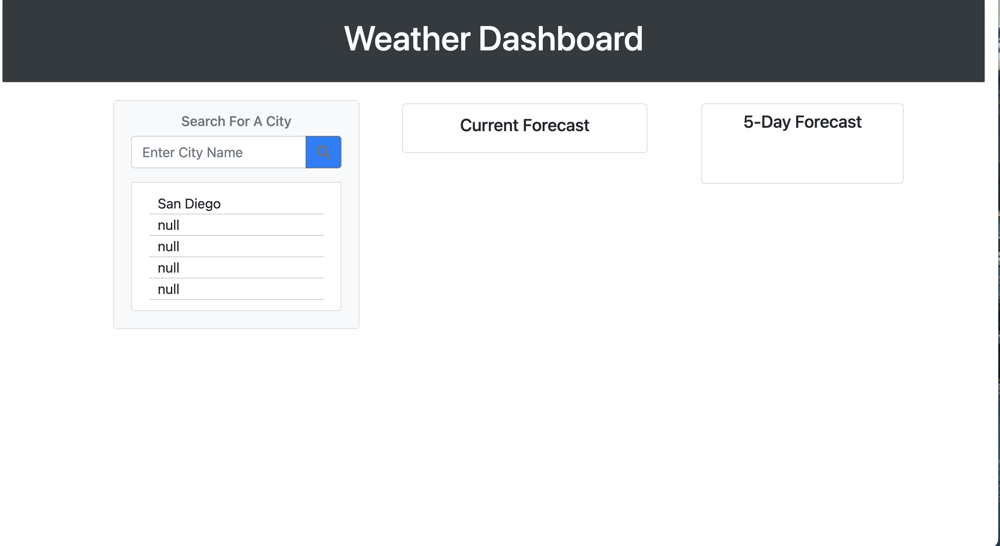

# Weather-City-Dashbaord

Purpose: To create a weather city dashboard that stores old cityies that were search in the local storage, calls an api, and uses bootstrap.

Screenshots of deployed website:

